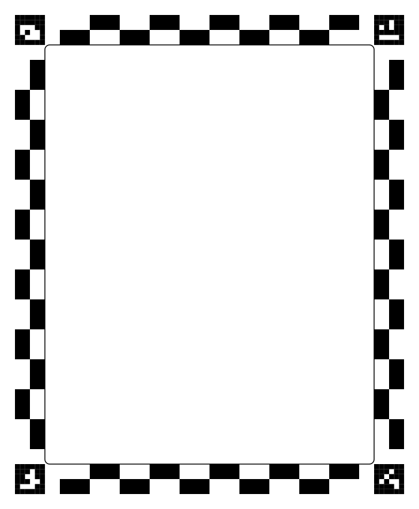
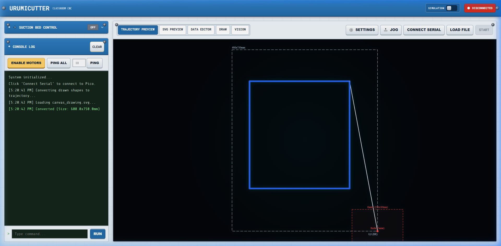

# Custom Frame Calibration & Tuning Guide

This guide explains how to design, configure, and calibrate a custom-sized working bed for the UrumiCutter vision system. Dimensional accuracy relies on precise alignment between the physical ArUco markers printed on the bed and the software configuration.

---

## 1. Configuring the Software Dimensions (`custom.json`)

The UrumiCam vision system uses a configuration file to understand the real-world physical size of your working area. 
Edit the file at `UrumiCam/server/method2/config/custom.json`.

### Key Parameters:
- **`width` & `height`**: The absolute physical dimensions (in millimeters) of your desired workspace. (e.g., `600` and `750`).
- **`aruco_id`**: The 4 IDs from the 4x4 ArUco dictionary you plan to use for the corners. Standard is `[12, 13, 14, 15]`.
- **`aruco_size`**: The size of the printed ArUco markers in mm (e.g., `50`).
- **`aruco_pos`**: **Critical for dimensional accuracy.** These are the exact (X, Y) coordinates in millimeters where the *centers* of the ArUco markers will be placed. 
  - Top-Left: `[0, 0]`
  - Top-Right: `[width, 0]`
  - Bottom-Right: `[width, height]`
  - Bottom-Left: `[0, height]`

If your printed markers are placed at different offsets, you **must** update the `aruco_pos` array to match the actual measured distance between the marker centers on the physical bed. The vision system uses this array to compute the perspective homography mapping.

---

## 2. Setting the Usable Margins

The camera often picks up the printed border lines or paper edges, which can falsely be detected as trajectories (toolpaths) by the skeletonization algorithm.

In `custom.json`, under the `"margins"` block, you will find:
```json
"margins": {
  "inner_content": 26,
  ...
}
```
- **`inner_content`**: The distance in mm to crop *inward* from the 0,0 boundary. If set to `26`, the system will entirely ignore the outer 26mm perimeter. Ensure you draw your ink trajectories inside this safe zone.

---

## 3. Generating the Physical Template

Once your dimensions are set, you need a printable template that matches your JSON configuration exactly.

1. Open `frame-design/generate_custom_svg.py`.
2. Update the `width` and `height` variables to match your `custom.json`.
3. Update `offset_x` and `offset_y` to give enough printing bleed (e.g., `50`).
4. Run the script:
   ```bash
   python generate_custom_svg.py
   ```
5. A `custom.svg` file will be generated. Print this file at exactly **100% scale**. Do not let your printer driver "Fit to Page" or scale the document.

---

## 4. Updating the UI Configuration

Because the UrumiCutter frontend needs to know the physical dimensions to render the background grids and calculate cut boundaries, you must update the Machine Settings in the browser.

1. Open the UrumiCutter web interface.
2. Click the **Settings** button (gear icon) in the toolbar.
3. Under the **Physical Dimensions** section, update the **Bed Width** and **Bed Height** to match the values you put in `custom.json` (e.g., `600` and `750`).
4. Close the modal. The background grid will instantly resize to match your physical bed.

---

## 5. Validating Dimensional Accuracy

After printing the bed and laying it flat on the machine, you must test the scaling to ensure precision.

1. Draw a test square (e.g., exactly 100x100mm) using a dark pen in the center of the bed.
2. Upload the photo via the UrumiCam interface.
3. Check the Python server console output. You will see a log similar to:
   > `Success! Saved rectified_bed.png. W: 548, H: 698, Dots/mm: 3.897`
4. In the UrumiCutter UI **Draw Tab**, measure the imported trajectory against the 50mm background grid.
5. **Troubleshooting Scaling:**
   - If the drawn square is larger/smaller in the UI than in real life, your printer likely scaled the `custom.svg` template. Measure the physical distance between the ArUco marker centers with a ruler. If the physical distance is 590mm instead of 600mm, update `aruco_pos` in `custom.json` to reflect the true physical distance. The algorithm will automatically adjust and restore perfect dimensional accuracy.

---

## 6. Example Walkthrough

### Step 1: Generate the Template
After configuring your 600x750mm frame in `custom.json`, you run `generate_custom_svg.py`. The resulting `custom.svg` will look like a clean border encompassing four ArUco markers:

<p align="center">
  
</p>

### Step 2: Physical Verification and Upload
Print the file. Draw your physical design on the workspace (staying inside the `inner_content` margin bounds), then capture a top-down photo to upload.

<p align="center">
  
</p>

### Step 3: Trajectory Preview & Cut
UrumiCam will extract only the inner safe zone, stripping away the outer margins perfectly. The ink is converted to a precision trajectory that you can preview in the UI before cutting.

<p align="center">
  
</p>

*By ensuring your `aruco_pos` strictly matches the physical printed distance between marker centers, the final trajectory dimensions will map onto the machine's G-code coordinates with sub-millimeter accuracy.*
